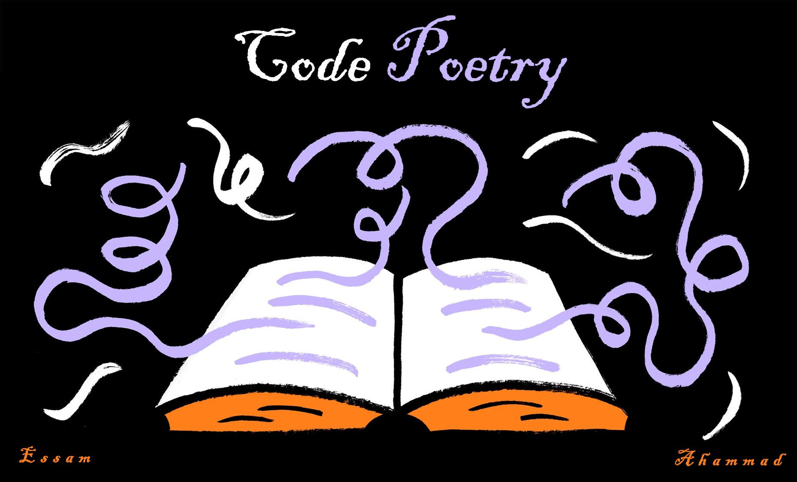

# Poetry
Poetry that are recited and printed using Python. It will help you to relax your mind after hours of coding. Just chill and run this Python scripts which you feel monotonous.

This unique idea was first thought by Essam Sami. He is the maintainer of this repository and he created the initial scripts. Later his friend, Ahammad Shawki helped him to make those scripts more engaging.

## How to use
## How to contribute
## License
